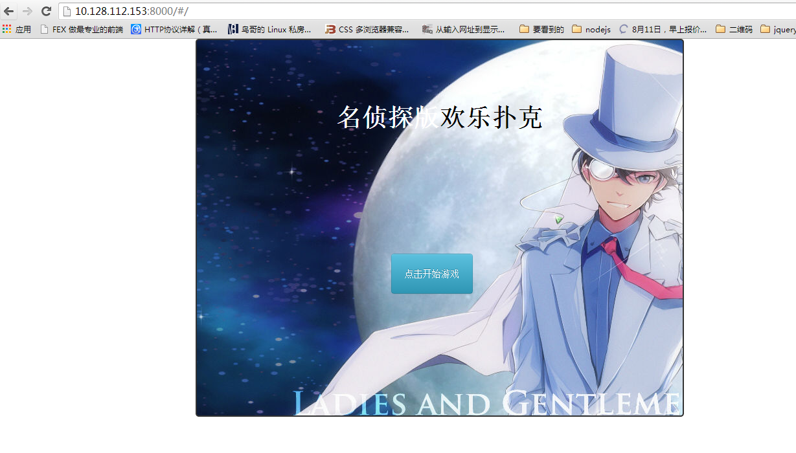
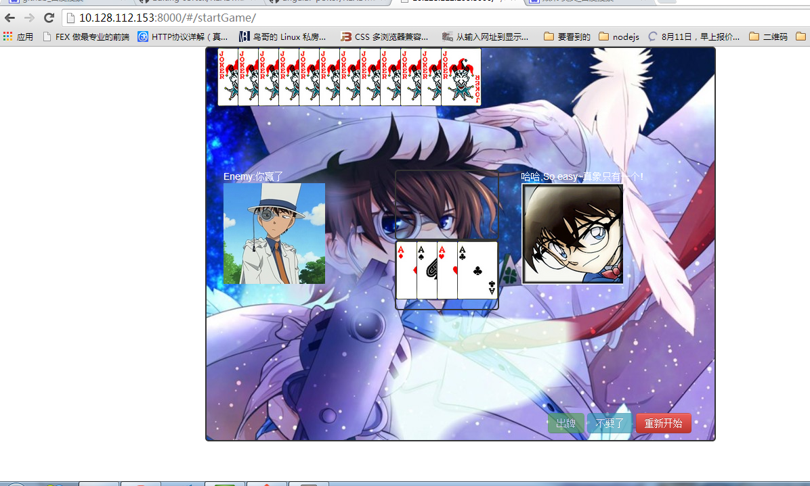

#angular-poker

使用angularjs写的一个网页端扑克牌小游戏,纯js实现,代码里写了比较多的注释,前端使用了一些bootstrap的东西,运行的话直接起个静态服务器,或者直接使用node的anywhere就可以运行
试玩链接:
http://www.panyifei.com/angular-poker/#/

##规则说明
与电脑对战,谁先出完谁获胜,目前支持单张,对子,3张,炸弹.

##效果显示
游戏开始

游戏进行中

游戏结束
